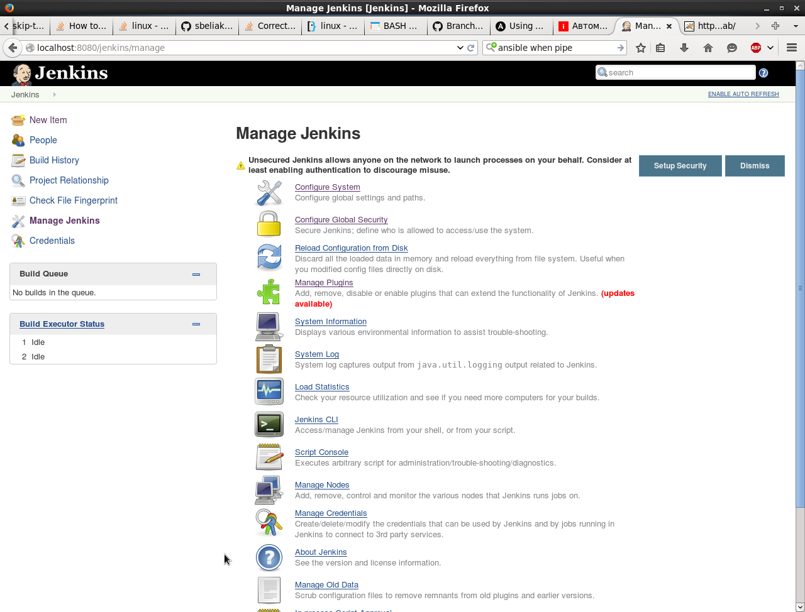
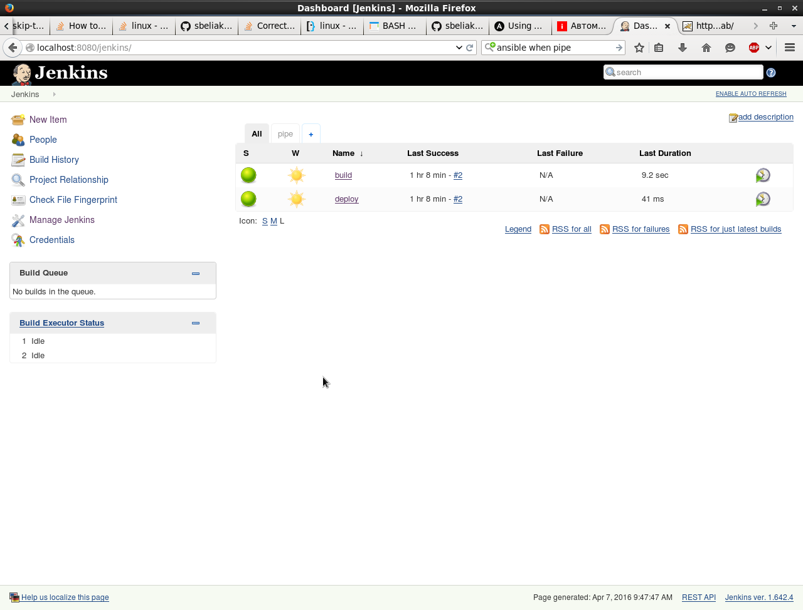
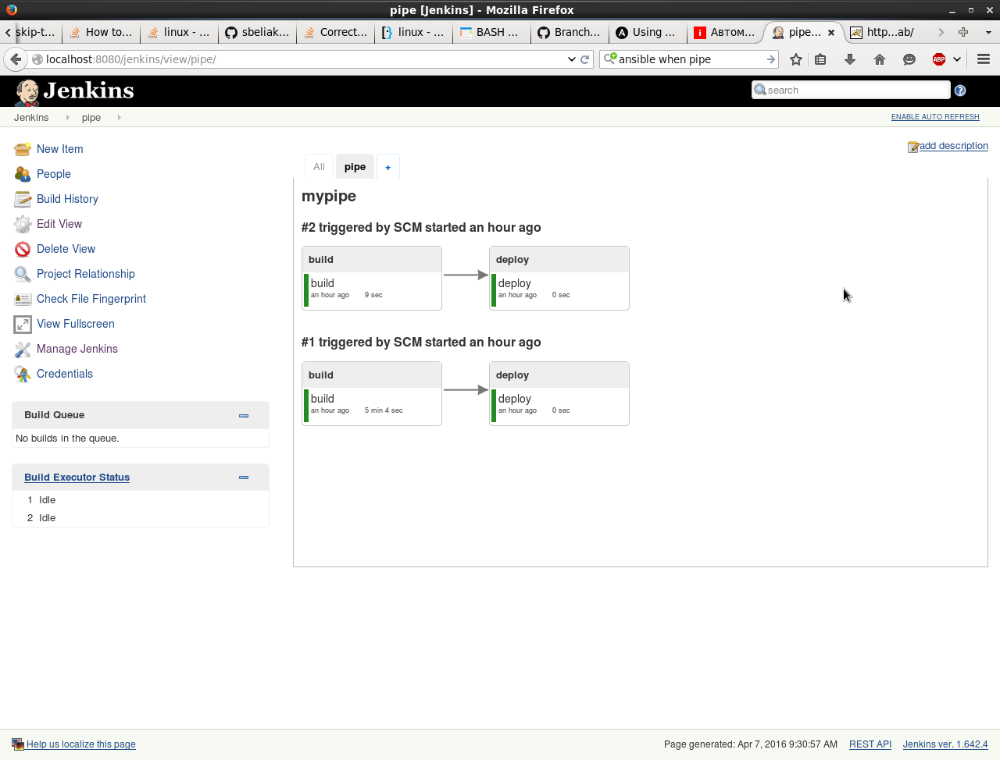
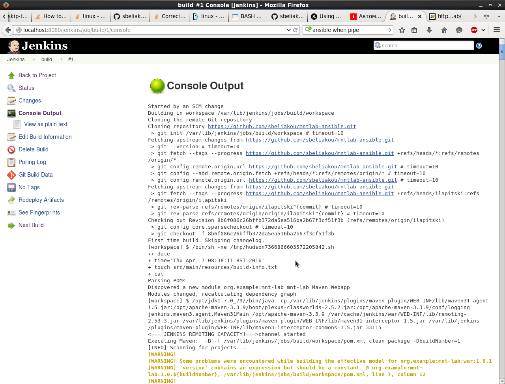
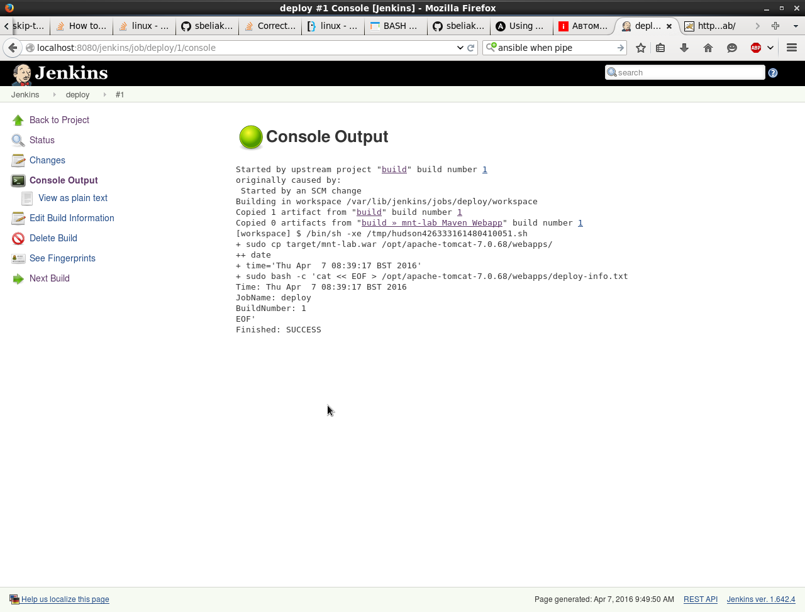
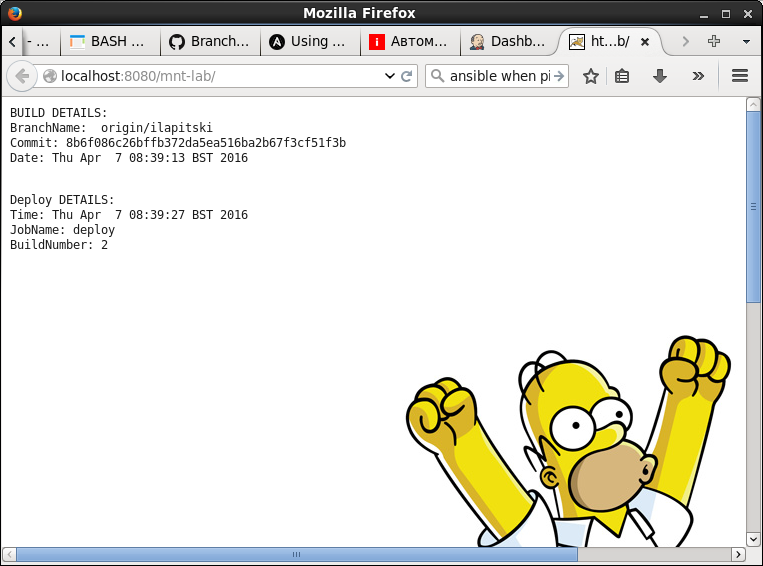

#ansible task 

[common](roles/common) - install common nginx web envinronment

[openJDK 1.7.0 and Oracle JDK 7](roles/java) - install Java

[tomcat 7.0.68](roles/tomcat), install tomcat. Can be standalone - ansible log file [here](tomcat.log), depends on java and common

[jenkins](roles/jenkins), install jenkins (can be standalone with nginx - ansible log file [here](jenkins.log), depends on java and common

[all](roles/all) - empty role to launch all other roles, ansible log file [here](all.log)

```
.
├── all.log                ---  final log file
├── callback_plugins
│   ├── profile_tasks.py   ---  changes log output
│   └── profile_tasks.pyc
├── idempotent.log         --- check of idempotentancy of playbook
├── jenkins.log            ---  standalone jenkins install log file
├── library
│   └── unarchive.py       --- another unarchive module
├── provision2.log         --- old log
├── provision2.retry
├── provision2.yml         ---  main ansible file 
├              
├── roles
│              
├── stat.log               --- try to check file existance, in file list variable
├── tomcat.log             ---  standalone tomcat install log file
└── Vagrantfile            ---  vagrant up file
```






